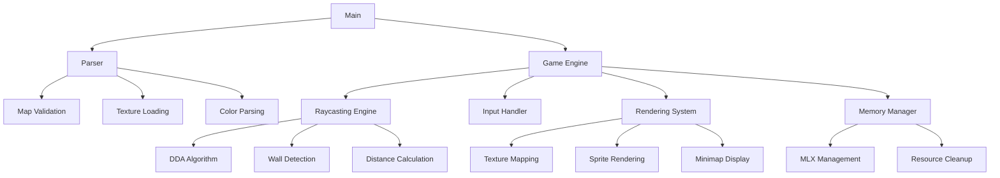

# Cub3D

A 3D maze game built in C using raycasting techniques, inspired by classic first-person shooters like Wolfenstein 3D. This project is part of the 42 curriculum and demonstrates advanced graphics programming, memory management, and mathematical concepts.

## Features

### Mandatory Features
- **3D Raycasting Engine**: Real-time 3D rendering of 2D maps
- **Texture Mapping**: Wall textures with different orientations (North, South, East, West)
- **Player Movement**: WASD movement with mouse look controls
- **Map Parsing**: Custom `.cub` file format support
- **Color Management**: Configurable floor and ceiling colors

### Bonus Features
- **Enhanced Graphics**: Additional wall textures and visual effects
- **Interactive Elements**: Doors that can be opened/closed
- **Minimap System**: Real-time overhead view with player position
- **Collectibles**: Chalk pieces with floating animations
- **Mirror Surfaces**: Reflective wall surfaces
- **Advanced Movement**: Mouse controls with pitch adjustment
- **Dynamic Lighting**: Distance-based lighting effects
- **Threading**: Background processing for smooth gameplay

## Technical Architecture



## Installation

### Prerequisites
- GCC compiler
- Make
- MLX library (MiniLibX)
- X11 development libraries (Linux)

### Build Instructions
```bash
# Clone the repository
git clone [repository-url] cub3d
cd cub3d

# Compile mandatory version
make

# Compile bonus version
make bonus

# Clean build files
make clean

# Remove all generated files
make fclean
```

## Usage

```bash
# Run mandatory version
./cub3D maps/map.cub

# Run bonus version  
./cub3d_bonus maps/bonus/map.cub
```

### Controls
- **WASD**: Movement
- **Mouse**: Look around (bonus)
- **Arrow Keys**: Rotate view
- **Space**: Interact with doors (bonus)
- **E**: Pick up items (bonus)
- **F**: Use chalk on walls (bonus)
- **M**: Toggle minimap (bonus)
- **ESC**: Exit game

## Map Format

Maps use the `.cub` extension with the following structure:

```
NO ./textures/north_wall.xpm
SO ./textures/south_wall.xpm
WE ./textures/west_wall.xpm
EA ./textures/east_wall.xpm

F 220,100,0
C 225,30,0

        1111111111111111111111111
        1000000000110000000000001
        1011000001110000000000001
        1001000000000000000000001
111111111011000001110000000000001
100000000011000001110111111111111
11110111111111011100000010001
11110111111111011101010010001
11000000110101011100000010001
10000000000000001100000010001
10000000000000001101010010001
11000001110101011111011110N0111
11110111 1110101 101111010001
11111111 1111111 111111111111
```

### Map Elements
- `1`: Wall
- `0`: Empty space
- `N/S/E/W`: Player starting position and orientation
- `D`: Door (bonus)
- `M`: Mirror surface (bonus)
- `c`: Chalk item (bonus)
- `k`: Key item (bonus)

## Memory Management

The project implements comprehensive memory management:

- **Automatic cleanup** on program termination
- **Error handling** with proper resource deallocation  
- **Valgrind-clean** execution (excluding known X11 library quirks)
- **Thread-safe** operations for bonus features

## Known Issues

### X11 Library Warnings
When running with Valgrind, you may see warnings related to:
1. **Mouse cursor management**: X11 cursor subsystem initialization creates persistent structures managed by the X server
2. **Window properties**: Uninitialized padding bytes in X11 protocol messages (harmless)

These are documented X11/MLX library behaviors, not application bugs.

## Project Structure

```
cub3d/
├── bonus/
│   ├── incs/           # Bonus headers
│   └── srcs/           # Bonus source files
├── incs/               # Main headers
├── srcs/               # Main source files
├── maps/               # Test maps
├── textures/           # Wall textures
├── Makefile
└── README.md
```

## Educational Objectives

This project demonstrates:
- **Mathematical concepts**: Vector operations, trigonometry, linear algebra
- **Graphics programming**: Raycasting, texture mapping, 2D/3D transformations
- **System programming**: Memory management, file I/O, event handling
- **Algorithm implementation**: DDA algorithm, flood fill validation
- **Code architecture**: Modular design, separation of concerns

## License

This project is part of the 42 School curriculum. Please respect academic integrity guidelines when referencing this code.